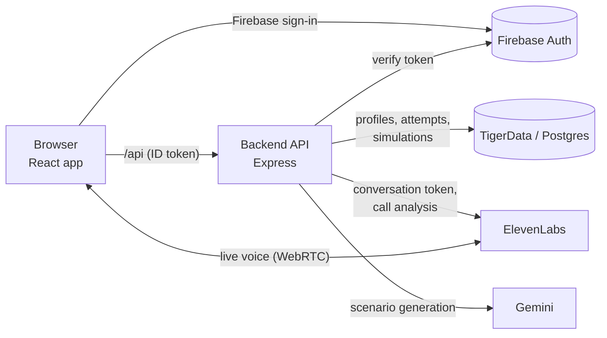

# Tellio

**Practise spotting scams before a real one reaches you.** Tellio is a scam-awareness training web app built at StormHacks 2026. Scam texts, emails and phone calls arrive on a practice phone in your browser; you react the way you would on your own phone, then a debrief shows the red flags you caught or missed. Nothing real is ever at risk: no real messages, links or calls leave the app.

## What it does

- **Three channels on one practice phone**
  - **Texts:** a scam SMS thread you can read and reply to, with a tracked fake link.
  - **Emails:** a phishing email with sender details and links to inspect.
  - **Calls:** a live AI voice caller (ElevenLabs) you can answer, talk to and hang up on, with live captions.
- **Debriefs that teach:** after each scenario you see what gave it away (urgency, unexpected fees, look-alike addresses, requests for codes) and what to check next time. Calls get their own debrief built from the redacted transcript.
- **Adaptive practice:** scenarios get harder as you make the right calls and ease off after misses. Call results are saved server-side and feed a per-user vulnerability profile.
- **Works without AI keys:** without ElevenLabs, calls fall back to a caption-only practice mode; without Gemini, built-in scenarios are used.

## How it works



1. You sign in with **Firebase** (email/password or Google). Every API request carries the Firebase ID token, which the backend verifies.
2. The **backend** (one Express server) stores your profile, runs text and call simulations under `/api/comms`, and saves every finished attempt to **Postgres**.
3. For a **call**, the backend hands the browser a short-lived ElevenLabs token; you talk to the voice agent directly. After you hang up, the backend fetches ElevenLabs' analysis, decides the outcome (did you share a code, card or personal info?) and saves a redacted record.
4. Progress and your vulnerability profile are computed server-side from those attempts.

The cross-cutting rules (canonical outcomes, scenario ids, auth) are written down in [`docs/call-integration.md`](docs/call-integration.md).

## Tech stack

| Layer | Technologies |
|---|---|
| Frontend | React 19, TypeScript, Vite 8, Tailwind CSS 4, React Router 7, Motion (animations), Lucide icons, View Transitions API |
| Voice | ElevenLabs Conversational AI (`@elevenlabs/react`, WebRTC), lazy-loaded with the call screen |
| Auth | Firebase Authentication (client SDK in the browser, `firebase-admin` token verification on the server) |
| Backend | Node.js 22, Express 5, TypeScript (run with `tsx`), zod validation, helmet |
| Database | TigerData (managed PostgreSQL) via `pg`, versioned SQL migrations |
| AI content | Google Gemini (`@google/genai`) for personalised call scenarios, with built-in fallbacks |
| Tests | Node's built-in test runner; supertest for the API |

## Repository layout

```
frontend/   React app: auth, onboarding, home, practice phone (texts, emails, calls), debriefs
  src/features/   auth · profile · training (scenarios, progress, call/ screen and debrief)
  src/comms/      client and hooks for simulated texts and calls (useSimulatedCall, useTextThread)
backend/    Express API, one server
  app/            users · training · scenarios · texts · calls · sim · http · db · shared
  fixtures/       built-in text and call scenarios
  scripts/        setup-agent.ts (creates the ElevenLabs voice agent)
docs/       call-integration.md: the shared contract (outcomes, scenario ids, auth rules)
PRODUCT.md  who Tellio is for and the product principles
```

Each folder has its own README with the details: [`frontend/README.md`](frontend/README.md), [`backend/README.md`](backend/README.md).

## Running it locally

### Prerequisites

- **Node.js 22.18 or newer**
- A **PostgreSQL** database. The team uses **TigerData**; any Postgres 15+ works.
- A **Firebase project** with Email/Password (and optionally Google) sign-in enabled, and its web-app config.

### 1. Backend

```bash
cd backend
npm install
cp .env.example .env
```

Fill in `backend/.env`:

- `DATABASE_URL`: your Postgres connection string. For TigerData, keep `sslmode=verify-full` and put the service's CA certificate in `backend/certs/` (gitignored), then reference it with a relative path: `…?sslmode=verify-full&sslrootcert=certs/tigerdata-ca.pem`. URL-encode special characters in the password.
- `FIREBASE_PROJECT_ID`: the same project as the frontend.

Then create the tables and start the server:

```bash
npm run migrate   # applies any new migrations; safe to re-run
npm run dev       # http://localhost:3000/api
```

### 2. Frontend

In a second terminal:

```bash
cd frontend
npm install
cp .env.example .env   # fill in the VITE_FIREBASE_* values from your Firebase web app
npm run dev            # http://localhost:5173
```

Open **http://localhost:5173**, create an account, complete onboarding, and start practising. Vite proxies `/api` to the backend, so there's nothing else to configure locally.

### 3. Optional: live voice calls

Without these, calls still work in caption-only practice mode.

1. Create an ElevenLabs API key (Settings → API Keys, with write access to Agents) and set `ELEVENLABS_API_KEY` in `backend/.env`.
2. From `backend/`, run `npm run setup:agent`, then set the printed `ELEVENLABS_AGENT_ID` in `backend/.env`.
3. Restart the backend and answer a call scenario.

### 4. Optional: AI-generated call scenarios

Set `GEMINI_API_KEY` in `backend/.env`. Without it, generation uses built-in scenarios (and says so).

## Tests and checks

```bash
cd backend  && npm run typecheck && npm test
cd frontend && npm run lint && npm test && npm run build
```

Backend database tests run only when `TEST_DATABASE_URL` points at a dedicated database whose name ends in `_test`; otherwise they're skipped.

## Configuration reference

Only names are listed here; never commit real values. `.env` files are gitignored.

| Variable | Where | Required | Purpose |
|---|---|---|---|
| `DATABASE_URL` | backend | yes | Postgres connection (TLS verified) |
| `FIREBASE_PROJECT_ID` | backend | yes | Verifies users' ID tokens |
| `HOST`, `PORT`, `APP_ORIGIN`, `NODE_ENV` | backend | no | Defaults: `127.0.0.1`, `3000`, `http://localhost:5173`, `development` |
| `ELEVENLABS_API_KEY`, `ELEVENLABS_AGENT_ID` | backend | no | Live voice calls |
| `ELEVENLABS_DEFAULT_VOICE_ID`, `ELEVENLABS_LLM`, `CALL_MAX_SECONDS` | backend | no | Voice agent tuning |
| `GEMINI_API_KEY` | backend | no | AI-generated call scenarios |
| `TEXT_FOLLOWUP_SEC`, `TEXT_IDLE_END_SEC` | backend | no | Simulated text timing |
| `TEST_DATABASE_URL` | backend | no | Database tests (name must end in `_test`) |
| `VITE_FIREBASE_*` | frontend | yes | Firebase web-app config (public) |
| `VITE_COMMS_BASE_URL` | frontend | no | Override for `/api/comms` |

## Deploying

- Serve the built frontend (`frontend/dist`) and the backend's `/api` from the **same HTTPS origin**, and rewrite app routes (`/home`, `/train/*`, `/onboarding`, `/caught`, …) to `index.html`.
- Set `NODE_ENV=production` and `APP_ORIGIN` to that HTTPS origin, and add the domain to Firebase's authorized domains.
- Run `npm run migrate` against the production database before starting the backend.

## Further reading

- [`PRODUCT.md`](PRODUCT.md): users, positioning and product principles
- [`docs/call-integration.md`](docs/call-integration.md): the call contract (outcomes, scenario ids, auth, data handling)
- [`backend/README.md`](backend/README.md): API routes, structure and dependency rules, simulation state, ElevenLabs setup
- [`frontend/README.md`](frontend/README.md): app flow, phone calls and the fallback mode, configuration
