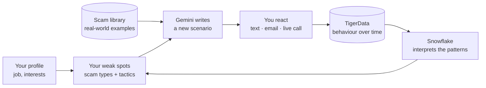
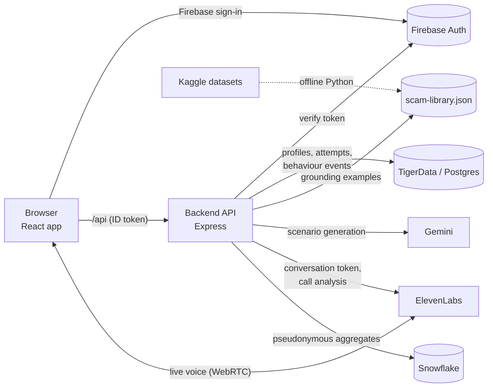

# Tellio

**Practise spotting scams before a real one reaches you.** Tellio is a scam-awareness training web app built at StormHacks 2026. Scam texts, emails and phone calls arrive on a practice phone in your browser; you react the way you would on your own phone, then a debrief shows the red flags you caught or missed. Nothing real is ever at risk: no real messages, links or calls leave the app.

## Overview

Tellio is an **adaptive scam simulator**: it learns how you get fooled and writes increasingly personal training scenarios aimed at exactly that. Each scenario you finish feeds the next one:



| Piece            | What it does                                                                                                                                                                                                                                                                                                                                                                                                                                                                                                                                                                                                                               | Where you see it                                                                                                                   |
| ---------------- | ------------------------------------------------------------------------------------------------------------------------------------------------------------------------------------------------------------------------------------------------------------------------------------------------------------------------------------------------------------------------------------------------------------------------------------------------------------------------------------------------------------------------------------------------------------------------------------------------------------------------------------------ | ---------------------------------------------------------------------------------------------------------------------------------- |
| **Scam library** | An offline Python pipeline ([`data-pipeline/`](data-pipeline/)) curates ~600 real phishing emails, spam texts and scam-call patterns from public datasets into `backend/fixtures/scam-library.json`. Gemini gets 2–3 matching examples (by channel, scam type, tactics and difficulty); for a genuine email it gets hand-picked real legitimate emails from the same datasets instead. The practice path is built from it too: real phishing emails with invented names, real scam-call patterns, and texts Gemini wrote from library examples; only the genuine "looks safe" messages are hand-written. No embeddings, no runtime Python. | "Grounded in real-world scam patterns" (or "genuine emails"), and each practice scenario's source line, shown once you've answered |
| **Gemini**       | Writes a personalised scam email or call script aimed at your current weak spot. About one generated email in three is genuine instead, so Report is not always the right answer. Every result is validated (red flags must quote the text exactly, no real brands) with a fallback.                                                                                                                                                                                                                                                                                                                                                       | "Written by Gemini"                                                                                                                |
| **ElevenLabs**   | Runs the live scam call you answer and talk to (a voice agent with Gemini 2.5 Flash as its LLM), then scores what you gave away (codes, card, personal details).                                                                                                                                                                                                                                                                                                                                                                                                                                                                           | Call debrief: "powered by ElevenLabs"                                                                                              |
| **TigerData**    | Stores every tap and decision, with the scam tactics involved, in a TimescaleDB hypertable and turns it into metrics over time.                                                                                                                                                                                                                                                                                                                                                                                                                                                                                                            | **Your scam instincts** card and chart                                                                                             |
| **Snowflake**    | Compares pseudonymous aggregates across trainees to find which tactic combinations fool you (e.g. authority with urgency); with Cortex on, writes the summary.                                                                                                                                                                                                                                                                                                                                                                                                                                                                             | **What Tellio has learned**, labelled by what actually ran                                                                         |
| **Firebase**     | Sign-in (email/password or Google).                                                                                                                                                                                                                                                                                                                                                                                                                                                                                                                                                                                                        | Login                                                                                                                              |

Every optional service degrades honestly: without ElevenLabs, calls become caption-only practice; without Gemini, scenarios are built from the scam library; without Snowflake, the backend's own analysis runs ("Built-in analysis"). At startup the API prints one line per integration saying what's on.

## What it does

- **Three channels on one practice phone**
  - **Texts:** a scam (or genuine) SMS to judge: tap the link to see where it really goes (it never opens), then report it or mark it safe.
  - **Emails:** a phishing (or genuine) email with sender details and links to inspect.
  - **Calls:** a live AI voice caller you can answer, talk to and hang up on, with live captions.
- **Not everything is a scam:** close to half of the practice path's texts and emails are genuine, and about one generated email in three is too, so you practise telling real from fake instead of reporting everything. Calls are always scams.
- **Debriefs that teach:** after each scenario you see what gave it away (urgency, unexpected fees, look-alike addresses, requests for codes) and what to check next time, then **What Tellio learned from this** shows what changed in your profile and offers the next scenario made for you.
- **Adaptive practice:** scenarios get harder as you make the right calls and ease off after misses, and Home's **Next for you** names the scam type Tellio will train next and why.

## How it works



1. You sign in with **Firebase**. Every API request carries the Firebase ID token, which the backend verifies.
2. For a **generated scenario**, the backend reads your profile and weak spots, retrieves 2–3 matching examples from the scam library and asks **Gemini** for a new email or call script, then validates it before you see it.
3. For a **call**, the backend hands the browser a short-lived ElevenLabs token; you talk to the voice agent directly. After you hang up, the backend fetches ElevenLabs' analysis, decides the outcome and saves a redacted record.
4. Texts and emails send small behaviour events (`POST /api/training/events`) with the scenario's tactics to **TigerData**, and each finished scenario is saved as an attempt. Progress, difficulty, metrics and the vulnerability analysis (**Snowflake**, or the built-in fallback) are computed server-side from those attempts and events.

The cross-cutting rules are written down in [`docs/call-integration.md`](docs/call-integration.md) (calls, outcomes, auth) and [`docs/dataset.md`](docs/dataset.md) (dataset sources and licences).

## Tech stack

| Layer             | Technologies                                                                                                                                                                                                                                                                             |
| ----------------- | ---------------------------------------------------------------------------------------------------------------------------------------------------------------------------------------------------------------------------------------------------------------------------------------- |
| Frontend          | React 19, TypeScript 6, Vite 8, React Router 7. Styling is hand-written CSS on top of Tailwind CSS 4's base layer and `@theme` design tokens, with Motion for animation, Lucide icons, the View Transitions API, and Inter and Newsreader from Google Fonts                              |
| Texts             | Server-sent events: the backend streams the simulated thread and the browser reads it with `EventSource`                                                                                                                                                                                 |
| Voice             | ElevenLabs Conversational AI: `@elevenlabs/react` over WebRTC (LiveKit underneath), lazy-loaded with the call screen. The voice agent's LLM is Gemini 2.5 Flash (`ELEVENLABS_LLM`). The backend calls the ElevenLabs REST API for session tokens, agent setup and the post-call analysis |
| Auth              | Firebase Authentication: email/password, Google sign-in and password reset through the client SDK; the server verifies ID tokens with `firebase-admin` (no service-account key). Firebase Analytics loads only when a measurement ID is set                                              |
| Backend           | Node.js 22.18+, Express 5, TypeScript 6 run directly with `tsx` (no build step), zod 4 for config and request validation, helmet                                                                                                                                                         |
| Database          | TigerData (managed PostgreSQL with TimescaleDB) through `pg`; plain SQL migrations applied by a small runner (`npm run migrate`)                                                                                                                                                         |
| AI content        | Google Gemini through `@google/genai`, using JSON-schema structured output. It tries `gemini-3.5-flash-lite`, then `gemini-3.1-flash-lite`, then `gemini-3.8-flash`, and falls back to scenarios built from the scam library                                                             |
| Analytics         | The `behavior_events` TimescaleDB hypertable (a plain table on ordinary Postgres) for behaviour metrics. Snowflake through its SQL REST API with a programmatic access token (no driver) for the vulnerability analysis, optionally worded by Cortex `COMPLETE`                          |
| Data              | Python 3.12, pandas and kagglehub, offline only ([`data-pipeline/`](data-pipeline/)). Sources: a Kaggle phishing-email dataset, a Kaggle scam-call dataset and the UCI SMS Spam Collection ([`docs/dataset.md`](docs/dataset.md))                                                        |
| Tests and tooling | Node's built-in test runner (backend through `tsx` with supertest; frontend with Node's type stripping), Python `unittest` for the pipeline, ESLint 10 with typescript-eslint, Prettier (backend), `tsc` type checks                                                                     |
| Development       | Built with Claude Code                                                                                                                                                                                                                                                                   |

## Repository layout

```
frontend/   React app: auth, onboarding, home, practice phone (texts, emails, calls), debriefs
  src/features/   auth · profile · training (scenarios, progress, call/ screen and debrief)
  src/comms/      client and hooks for simulated texts and calls (useSimulatedCall, useTextThread)
backend/    Express API, one server
  app/            users · training · scenarios · behavior · insights · texts · calls · sim · http · db · shared
  fixtures/       scam-library.json (the curated dataset library) and the practice-path call/text scenarios built from it
  scripts/        setup-agent.ts (ElevenLabs voice agent), build-practice.ts (practice path from the library), snowflake-setup.sql
data-pipeline/  offline Python that builds backend/fixtures/scam-library.json from Kaggle datasets (never runs in the app)
docs/       dataset.md (sources, licences, counts) and call-integration.md (calls, outcomes, auth)
```

Each folder has its own README with the details: [`frontend/README.md`](frontend/README.md), [`backend/README.md`](backend/README.md), [`data-pipeline/README.md`](data-pipeline/README.md).

## Running it locally

### Prerequisites

- **Node.js 22.18 or newer**
- A **PostgreSQL** database. The team uses **TigerData**; any Postgres 15+ works.
- A **Firebase project** with Email/Password (and optionally Google) sign-in enabled, and its web-app config.

### 1. Backend

```bash
cd backend
npm install
cp .env.example .env
```

Fill in `backend/.env`:

- `DATABASE_URL`: your Postgres connection string. For TigerData, keep `sslmode=verify-full` and put the service's CA certificate in `backend/certs/` (gitignored), then reference it with a relative path: `…?sslmode=verify-full&sslrootcert=certs/tigerdata-ca.pem`. URL-encode special characters in the password.
- `FIREBASE_PROJECT_ID`: the same project as the frontend.

Then create the tables and start the server:

```bash
npm run migrate   # applies any new migrations; safe to re-run
npm run dev       # http://localhost:3000/api
```

Run `npm run migrate` again after pulling changes: the API refuses to start, naming the missing migrations, while the database is behind the code.

### 2. Frontend

In a second terminal:

```bash
cd frontend
npm install
cp .env.example .env   # fill in the VITE_FIREBASE_* values from your Firebase web app
npm run dev            # http://localhost:5173
```

Open **http://localhost:5173**, create an account, complete onboarding, and start practising. Vite proxies `/api` to the backend, so there's nothing else to configure locally.

### 3. Optional: live voice calls

Without these, calls still work in caption-only practice mode.

1. Create an ElevenLabs API key (Settings → API Keys, with write access to Agents) and set `ELEVENLABS_API_KEY` in `backend/.env`.
2. From `backend/`, run `npm run setup:agent`, then set the printed `ELEVENLABS_AGENT_ID` in `backend/.env`.
3. Restart the backend and answer a call scenario.

### 4. Optional: Gemini-written emails and calls

Set `GEMINI_API_KEY` in `backend/.env`. Without it, generation builds scenarios from the scam library; only Gemini-written ones show "Written by Gemini".

### 5. Optional: Snowflake vulnerability analysis

Run `backend/scripts/snowflake-setup.sql` once in Snowflake, create a programmatic access token for the service user, then set `SNOWFLAKE_ACCOUNT`, `SNOWFLAKE_PAT`, `SNOWFLAKE_WAREHOUSE`, `SNOWFLAKE_DATABASE` and `SNOWFLAKE_ID_SALT` (16+ characters, keep it stable) in `backend/.env` (optionally `SNOWFLAKE_SCHEMA`, `SNOWFLAKE_ROLE`, `SNOWFLAKE_CORTEX_MODEL`). The startup log says which analysis is in use, and Home's card credits Snowflake (or Cortex) only when it really produced the result. Snowflake only receives an HMAC of the user id and counts and rates per category, tactic, tactic pair and channel.

### 6. Optional: rebuild the scam library

The library is committed, so this is only needed to change it. See [`data-pipeline/README.md`](data-pipeline/README.md): `python -m tellio_data download`, then `build`. All three datasets download anonymously. Then rebuild the practice path from it with `npm run build:practice` in `backend/` (add `-- --texts` to have Gemini write any missing practice texts).

## Tests and checks

```bash
cd backend  && npm run typecheck && npm test
cd frontend && npm run lint && npm test && npm run build
cd data-pipeline && .venv/bin/python -m unittest
```

Backend database tests run only when `TEST_DATABASE_URL` points at a dedicated database whose name ends in `_test`; otherwise they're skipped.

## Configuration reference

Only names are listed here; never commit real values. `.env` files are gitignored.

| Variable                                                                                               | Where    | Required                    | Purpose                                                                     |
| ------------------------------------------------------------------------------------------------------ | -------- | --------------------------- | --------------------------------------------------------------------------- |
| `DATABASE_URL`                                                                                         | backend  | yes                         | Postgres connection (TLS verified)                                          |
| `FIREBASE_PROJECT_ID`                                                                                  | backend  | yes                         | Verifies users' ID tokens                                                   |
| `HOST`, `PORT`, `APP_ORIGIN`, `NODE_ENV`                                                               | backend  | no                          | Defaults: `127.0.0.1`, `3000`, `http://localhost:5173`, `development`       |
| `ELEVENLABS_API_KEY`, `ELEVENLABS_AGENT_ID`                                                            | backend  | no                          | Live voice calls                                                            |
| `ELEVENLABS_DEFAULT_VOICE_ID`, `ELEVENLABS_LLM`, `CALL_MAX_SECONDS`                                    | backend  | no                          | Voice agent tuning                                                          |
| `GEMINI_API_KEY`                                                                                       | backend  | no                          | Gemini-written emails and call scenarios                                    |
| `SNOWFLAKE_ACCOUNT`, `SNOWFLAKE_PAT`, `SNOWFLAKE_WAREHOUSE`, `SNOWFLAKE_DATABASE`, `SNOWFLAKE_ID_SALT` | backend  | no (all five for Snowflake) | Snowflake vulnerability analysis; the salt keys the pseudonymous trainee id |
| `SNOWFLAKE_SCHEMA`, `SNOWFLAKE_ROLE`, `SNOWFLAKE_CORTEX_MODEL`                                         | backend  | no                          | Defaults: `PUBLIC`, the token user's role, no Cortex wording                |
| `TEXT_FOLLOWUP_SEC`, `TEXT_IDLE_END_SEC`                                                               | backend  | no                          | Simulated text timing                                                       |
| `TEST_DATABASE_URL`                                                                                    | backend  | no                          | Database tests (name must end in `_test`)                                   |
| `VITE_FIREBASE_*`                                                                                      | frontend | yes                         | Firebase web-app config (public)                                            |
| `VITE_COMMS_BASE_URL`                                                                                  | frontend | no                          | Override for `/api/comms`                                                   |

## Deploying

- Serve the built frontend (`frontend/dist`) and the backend's `/api` from the **same HTTPS origin**, and rewrite app routes (`/home`, `/train/*`, `/onboarding`, `/caught`, …) to `index.html`.
- Set `NODE_ENV=production` and `APP_ORIGIN` to that HTTPS origin, and add the domain to Firebase's authorized domains.
- Run `npm run migrate` against the production database before starting the backend.

## Further reading

- [`docs/call-integration.md`](docs/call-integration.md): the call contract (outcomes, scenario ids, auth, data handling)
- [`docs/dataset.md`](docs/dataset.md): dataset sources, licences, what is committed and coverage
- [`backend/README.md`](backend/README.md): API routes, structure and dependency rules, simulation state, ElevenLabs setup
- [`frontend/README.md`](frontend/README.md): app flow, phone calls and the fallback mode, configuration
